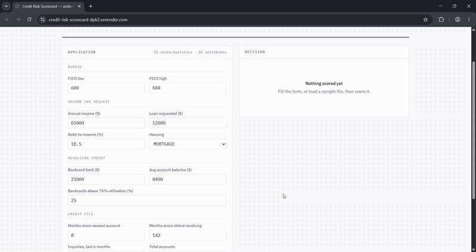
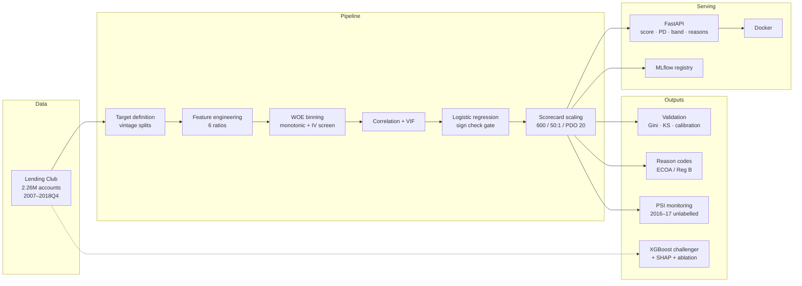

# Credit Risk Scorecard

A bank-style probability-of-default scorecard on Lending Club consumer loans:
WOE binning with monotonic constraints, logistic regression scaled into a
points table, ECOA adverse action reason codes, PSI drift monitoring, and a
gradient-boosted challenger with the deployment argument worked through on
measured evidence.

**[Live demo →](https://credit-risk-scorecard-dpk2.onrender.com/)**   ·
[API docs](https://credit-risk-scorecard-dpk2.onrender.com/docs)
*(free tier — first request after idle takes ~30s to wake)*

| | Out-of-time (2015, 283,026 accounts) |
|---|---|
| **Gini** | **0.321** |
| **KS** | **23.4** |
| Default rate, worst → best band | **28.4% → 4.1%** (7.0×, monotonic across all 10) |
| Incremental Gini over Lending Club's own grade | **+0.019** |
| Calibration gap, before → after intercept shift | +1.80pp → **0.00pp** |
| Characteristics on the card | 11 (82 attributes) |



---

## What this is

Most credit modelling portfolios stop at "I trained a classifier and got an AUC".
A bank does not ship a classifier. It ships a **points table** that a credit
committee can read, a **reason code** for every declined applicant, a
**monitoring pack** that detects population drift before losses appear, and a
documented argument for why the interpretable model was chosen over the more
accurate one.

This repository builds all four, and treats the analysis as the deliverable:
every methodological decision is measured rather than asserted, including the
ones that turned out to be wrong.

---

## Architecture



Every applicant scored through the API passes through the same
`src/features.py` and the same fitted `BinningProcess` used in development, so
a served score is identical to a development score for the same inputs.

---

## Findings

Five results that came out of measurement rather than expectation.

### 1. Feature engineering helps linear models and does nothing for tree models

Six theory-driven ratios were added — loan-to-income, debt service including the
requested loan, inquiry intensity, and three others.

| | Champion (logistic) | Challenger (XGBoost) |
|---|---:|---:|
| OOT Gini gain from the ratios | **+0.0125** | +0.0002 |

Gradient boosting already constructs these relationships internally: it splits
on loan amount within regions of income, which approximates `loan_to_income`
without being told about it. A linear model cannot. Feature engineering adds no
information to a tree ensemble — it changes the *representation* so an additive
model can use information that was present all along.

The champion also got **simpler**: 12 characteristics to 11.

### 2. Feature importance is not evidence of contribution

`addr_state` ranks **5th of 41** by mean |SHAP| in the challenger. Removing it
changes out-of-time Gini by +0.0008 — indistinguishable from zero, measured
three times across two feature pools and two hyperparameter settings.

SHAP measures how much a model *used* a characteristic, not whether using it
*helped*. Any importance ranking offered as justification for a model should be
checked by ablation.

### 3. Univariate IV screening discards conditionally useful characteristics

`loan_amnt` scores IV 0.0115 — below the 0.02 floor — because larger loans go to
higher-income borrowers, so the risk of the amount cancels against the quality
of the borrower. Hold income constant and the relationship is unambiguous.

Ablation valued it at **+0.0178 Gini**, more than every interaction and
non-linearity the challenger found across the surviving characteristics.
Expressed as a ratio it becomes visible to the screen: **IV 0.0115 → 0.0424**.

### 4. Score-level monitoring would have missed the drift

Across eight quarters of 2016–17, score PSI never breached 0.10 — it would have
reported a stable population throughout. Over the same window
`percent_bc_gt_75` reached **PSI 0.2967 (ACTION)**.

Characteristics drifted substantially in offsetting directions and the aggregate
score distribution absorbed it. Monitoring must run at both levels.

The monitoring population is **deliberately unlabelled**: 643,914 accounts from
2016–17 that do not mature until 2019–20 and have no bad flag. PSI compares
distributions, not outcomes, so accounts useless for validation are the entire
basis of the monitoring pack.

### 5. SHAP is not a drop-in substitute for points-based reason codes

Reason codes generated from the points table were compared against SHAP-derived
reasons on the same declined applicants:

| Metric | Value |
|---|---:|
| Top-1 exact match | **33.7%** |
| Mean overlap of top 4 | 2.60 of 4 |

For roughly two declined applicants in three, the *leading* reason differs
depending on which method produced it. Both approaches are used in production;
the point is that choosing between them is a decision that has to be defended,
not a technical detail.

---

## Champion vs challenger

| | Champion | Challenger |
|---|---:|---:|
| Model | Logistic regression on WOE | XGBoost, Optuna-tuned |
| Features | 11 | 41 |
| **OOT Gini** | 0.3214 | **0.3638** |
| OOT KS | 23.4 | 26.5 |
| OOT calibration gap | +0.0180 | +0.0159 |
| train → test degradation | 0.016 | 0.144 |

The challenger wins by **+0.0425 Gini** and is *better* calibrated, not worse.
The scorecard is still what would be deployed:

- **Reason codes fall out of the artefact.** Arithmetic on a published 82-row
  table, deterministic and reproducible by anyone holding it.
- **Drift localises to a named characteristic and bin.** 36% of the challenger's
  advantage lives in interactions, for which no PSI equivalent exists.
- **Recalibration is one parameter.** An intercept shift of +0.1559 closed the
  out-of-time calibration gap to zero with Gini unchanged to four decimal places.
- **The functional-form gap is small.** XGBoost given exactly the card's 11
  inputs reaches 0.3366 against 0.3214 — most of the remaining gap is feature
  selection, not linearity.

Fifty Optuna trials moved the challenger +0.0029, so its advantage is structural
rather than a tuning artefact. The full argument, including the case against the
champion, is in [`docs/challenger_analysis.md`](docs/challenger_analysis.md).

---

## Target definition

Lending Club publishes a terminal `loan_status` and no monthly delinquency
series, so a literal "90+ DPD within 12 months" is not constructible. The
definition adopted observes outcome over the full 36-month term, which is a
**lifetime PD**, closer to IFRS 9 than to a 12-month Basel PD. Naming that
correctly matters more than claiming a definition the data cannot support.

| Split | Vintages | Accounts | Bad rate |
|---|---|---:|---:|
| Development | 2013-01 – 2014-12 | 262,992 | 13.19% |
| Out-of-time | 2015-01 – 2015-12 | 283,026 | 14.89% |
| Monitoring | 2016-01 – 2017-12 | 643,914 | unlabelled |

Splits are **by vintage, not random**. 2015 is the most recent vintage that
fully matures inside a December 2018 extract. The 1.7pp rise in bad rate between
development and out-of-time is real population drift — Lending Club loosened
underwriting as volume scaled — and it is what makes the out-of-time window
informative rather than decorative.

Full exclusion waterfall and leakage controls:
[`docs/target_definition.md`](docs/target_definition.md).

---

## The scorecard

Base score 600 at 50:1 odds, PDO 20. Every 20 points doubles the good:bad odds,
so the gap from 640 to 660 means the same as 700 to 720.

| Characteristic | Points spread | | Characteristic | Points spread |
|---|---:|---|---|---:|
| `fico` | 29 | | `loan_to_income` ★ | 9 |
| `avg_cur_bal` | 24 | | `mo_sin_old_rev_tl_op` | 8 |
| `dti_with_loan` ★ | 18 | | `annual_inc` | 6 |
| `mo_sin_rcnt_tl` | 17 | | `percent_bc_gt_75` | 6 |
| `total_bc_limit` | 14 | | `home_ownership` | 3 |
| `inq_intensity` ★ | 11 | | | |

★ engineered ratio. The points table reconciles to the model within 0.004 PD,
the residual being the cost of rounding points to integers.

**Two characteristics failed the coefficient sign check** — `revol_bal` and
`revol_util` both reversed sign in the multivariate fit, a suppression effect
from having a ratio and both its components in the model. VIF is a linear
diagnostic and a ratio is not a linear function of its components, so all three
sat below the ceiling and the instability appeared anyway. Both were dropped by
the gate.

---

## Reason codes

At a policy cutoff of 530 (19.1% declined; 25.87% default among declined against
12.29% approved), each declined applicant receives up to four principal reasons,
ranked by points forgone against the population average.

```
Application declined. Score 527 (cutoff 530).

Principal reasons:
  1. Length of time revolving accounts established
  2. Level of balances maintained across accounts
  3. Amount requested relative to income
  4. Amount of credit available on revolving accounts
```

The conventional method ranks shortfall against the *maximum* attainable. That
was implemented, measured, and rejected: **four of eleven characteristics could
never appear in any disclosure**, because a narrow characteristic's entire range
is smaller than a typical partial shortfall on a wide one. Ranking against the
population mean fixes it. See [`docs/reason_codes.md`](docs/reason_codes.md).

---

## Quickstart

### Score against the live service

```bash
curl -X POST https://credit-risk-scorecard-dpk2.onrender.com/score \
  -H "Content-Type: application/json" \
  -d '{"fico_range_low":620,"fico_range_high":624,"annual_inc":32000,
       "loan_amnt":25000,"dti":28.5,"total_bc_limit":4500,"avg_cur_bal":1200,
       "percent_bc_gt_75":80,"mo_sin_rcnt_tl":2,"mo_sin_old_rev_tl_op":40,
       "inq_last_6mths":4,"total_acc":9,"home_ownership":"RENT"}'
```

### Run it locally

```bash
git clone https://github.com/ank018/credit-risk-scorecard
cd credit-risk-scorecard
docker build -t credit-scorecard .
docker run -p 8000:8000 credit-scorecard
```

The serving artefacts are committed (~90 KB total), so the image builds from a
clean clone without the 1.5 GB dataset.

### Load the registered model

```python
import mlflow, pandas as pd
m = mlflow.pyfunc.load_model("models:/credit-scorecard-champion/latest")
m.predict(applications_df)   # -> score, probability_of_default
```

`features.py` ships with the model via `code_paths`, so the registered version
carries the same feature derivation as the pipeline and the API — three
consumers, one implementation. Note that MLflow enforces the logged input schema
strictly and will reject an integer where a float is expected: pass floats for
continuous fields such as `percent_bc_gt_75`. The FastAPI service coerces types
properly through Pydantic and has no such constraint.

---

## Reproducing the pipeline

Requires `accepted_2007_to_2018Q4.csv.gz` from the
[Lending Club dataset](https://www.kaggle.com/datasets/wordsforthewise/lending-club)
in `data/raw/`.

```bash
python -m venv .venv && source .venv/bin/activate   # Windows: .venv\Scripts\Activate.ps1
pip install -r requirements.txt

python src/01_build_base_table.py        # target definition, vintage splits
python src/02_woe_binning.py             # feature engineering, WOE, IV screen
python src/03_feature_selection.py       # correlation clustering, VIF
python src/04_logistic_regression.py     # champion + sign check gate
python src/05_scorecard.py               # points table
python src/06_evaluation.py              # Gini, KS, bands, calibration
python src/07_benchmark_and_calibration.py
python src/10_tune_challenger.py         # optional — params are committed
python src/08_challenger.py              # XGBoost + SHAP
python src/09_ablation.py                # five variants
python src/11_reason_codes.py            # ECOA reason codes
python src/12_psi_monitoring.py          # PSI drift
python src/13_mlflow_tracking.py         # tracking + registry
```

About 50 minutes end to end. `10_tune_challenger.py` is optional — the tuned
hyperparameters are committed in `models/xgb_params.json`, so the pipeline
reproduces the documented numbers without repeating the 20-minute search.

```bash
pytest        # 34 tests
```

The tests protect the invariants that matter in credit: attribute points sum to
the served score, the score inverts back to the model's PD, identical inputs
give identical reasons, and a larger loan on an identical file can never raise
the score.

---

## Repository

```
├── app/                    FastAPI service and demo console
├── src/
│   ├── features.py         feature derivation — shared by pipeline and API
│   ├── config.py           paths, constants, hyperparameter loading
│   └── 01–13_*.py          pipeline stages
├── tests/                  34 tests
├── docs/                   methodology memos
├── models/                 serving artefacts (committed)
├── reports/                metrics, tables, figures
└── Dockerfile
```

### Documentation

| Document | Covers |
|---|---|
| [`target_definition.md`](docs/target_definition.md) | Bad definition, observation and performance windows, exclusion waterfall, leakage controls |
| [`feature_selection.md`](docs/feature_selection.md) | Engineered ratios, WOE, IV screening, correlation and VIF |
| [`model_development.md`](docs/model_development.md) | Coefficients, sign check, scaling, validation, benchmark |
| [`challenger_analysis.md`](docs/challenger_analysis.md) | XGBoost, SHAP, ablation, the deployment argument |
| [`reason_codes.md`](docs/reason_codes.md) | ECOA framing, cutoff, ranking conventions, SHAP comparison |
| [`monitoring.md`](docs/monitoring.md) | PSI thresholds, drift findings, escalation actions |

---

## Limitations

1. **Accepted applicants only.** The dataset contains funded loans, so the model
   never sees anyone Lending Club declined. Reported performance is optimistic
   relative to a genuine through-the-door scorecard; correcting it requires
   reject inference, which is out of scope.
2. **Lifetime PD, not 12-month.** Driven by data availability, as above.
3. **36-month originations only**, so the card does not generalise to the
   60-month book.
4. **One out-of-time window.** A rolling evaluation across several vintages would
   better estimate how quickly performance decays.
5. **Univariate PSI only.** It monitors input distributions, not the relationship
   between inputs and outcome — a characteristic whose meaning changes while its
   distribution holds steady is invisible to it.
6. **The residual selection gap is unaddressed.** The 30 discarded
   characteristics are worth +0.0255 Gini to the challenger;
   `bc_limit_to_income` is an identified candidate, rejected at IV 0.0128 yet
   ranked 15th of 41 by SHAP.
7. **No interaction terms tested**, so the +0.0152 attributed to functional form
   is an upper bound on what the additive card cannot capture.
8. **Benign macro period.** 2013–2017 contains no credit stress; performance
   through a downturn is untested.

Not legal advice. The ECOA and fair lending framing describes requirements as
generally understood and is not a compliance opinion.

---

## Data

[Lending Club accepted loans 2007–2018Q4](https://www.kaggle.com/datasets/wordsforthewise/lending-club)
· 2,260,701 accounts · CC0.
